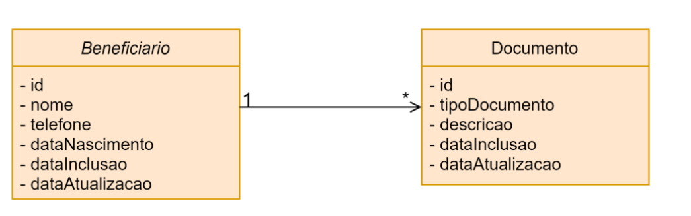
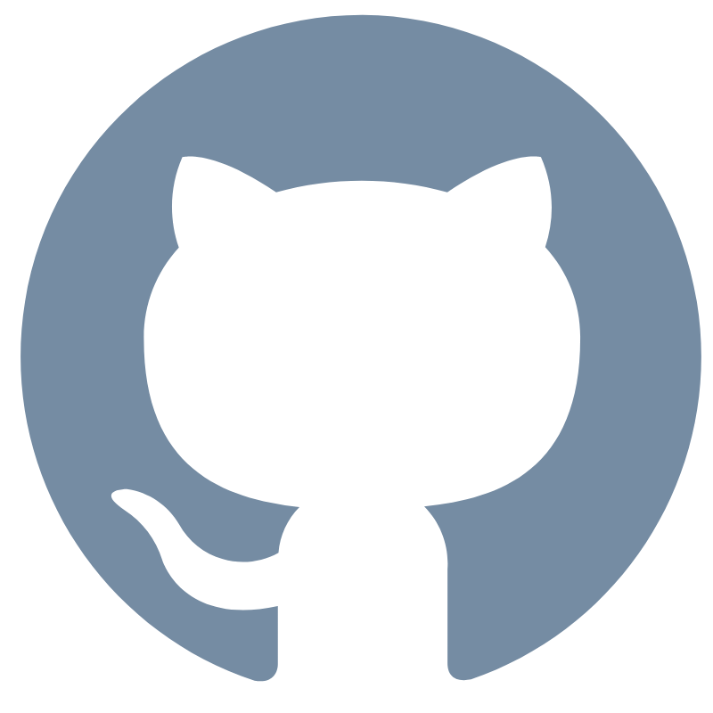

<!-- title -->
<h1 align="center">
    <span>🏥 Desafio de Vaga Junior - API de Gestão de Beneficiários de Plano de Saúde</span>
</h1>

<br>

<!-- badges -->
<div align="left">
    <!-- </img> -->
    </img>
    </img>
</div>

<br>

Considerando o seguinte diagrama de classes:



Crie uma aplicação utilizando Java e Spring Boot que forneça uma API REST para manter o cadastro
de beneficiários de um plano de saúde.


---

<br>


## 📌 Requisitos do Desafio

Fornecer uma API REST com as seguintes funcionalidades:

- ✅ Cadastrar um beneficiário com seus documentos
- ✅ Listar todos os beneficiários cadastrados
- ✅ Listar todos os documentos de um beneficiário
- ✅ Atualizar dados cadastrais de um beneficiário
- ✅ Remover um beneficiário

---

<br>

## 🔨 Tecnologias Utilizadas

- Java 17
- Spring Boot 3+
- Spring Data JPA
- PostgreSQL
- Maven
- OpenAPI/Swagger
- REST Client (.http) para testes

---

<br>

## 🚀 Rodando

### Requisitos

- Java 17
- Docker 29.0.0
- Apache Maven 3.8.7

<br>

### Passo a passo

1.  Clone esse repositorio:

     ```bash
     git clone git@github.com:lGabrielDev/Desafio-de-Vaga-Junior-Rocketseat.git;
     ```

<br>

2. Rode os comandos de execução:

     ```bash
     cd Desafio-de-Vaga-Junior-Rocketseat; # Navega para o diretório do projeto.

     mvn package -DskipTests;  # Compila o código Java e gera o arquivo .jar

     docker pull openjdk:17-ea-10-jdk;  # Baixa a imagem base do OpenJDK 17.

     docker compose up --build # Constrói as imagens Docker e sobe os containers
     ```

     <br>

     ⚠️  Se der problema no `docker pull` de alguma imagem, verifique se seu docker hub está logado.

     <br>

3.  Acesse: `http://localhost:8080/swagger-ui/index.html`

---

<br>

## ✨ Créditos
Este projeto foi desenvolvido como parte de um desafio proposto pela Rocketseat, com base no material do professor [Matheus Ferreira](https://github.com/matheuslf).

- Repositório do desafio:  [](https://github.com/matheuslf/com-rocketseat-desafio-junior)

- Vídeo do desafio:  [](https://www.youtube.com/watch?v=CRf783vNto0&t=302s)


[]()
